# ✨ Markdown Magic Demo

Phase 8.3 - Enhanced Markdown Preview

## 🧮 LaTeX Math Support

### Inline Math

The famous equation $E = mc^2$ changed physics forever.

In calculus, we define the derivative as $f'(x) = \lim_{h \to 0} \frac{f(x+h) - f(x)}{h}$.

### Block Math

The Schrödinger equation:

$$i\hbar\frac{\partial}{\partial t}\Psi(\mathbf{r},t) = \hat{H}\Psi(\mathbf{r},t)$$

The quadratic formula:

$$x = \frac{-b \pm \sqrt{b^2 - 4ac}}{2a}$$

Matrix multiplication:

$$\begin{pmatrix} a & b \\ c & d \end{pmatrix} \begin{pmatrix} e \\ f \end{pmatrix} = \begin{pmatrix} ae + bf \\ ce + df \end{pmatrix}$$

---

## 📊 Mermaid Diagrams

### Flowchart

```mermaid
flowchart TD
    A[Start] --> B{Is it working?}
    B -->|Yes| C[Great!]
    B -->|No| D[Debug]
    D --> B
    C --> E[Deploy]
    E --> F[🚀 Success!]
```



### Sequence Diagram


### Class Diagram


### State Diagram


### Gantt Chart


### Pie Chart


---

## 📝 Callouts

> [!NOTE]
> This is a helpful note for the reader.

> [!TIP]
> Pro tip: Use mermaid diagrams to visualize your architecture!

> [!WARNING]
> Make sure to validate user input before processing.

> [!CAUTION]
> This operation cannot be undone!

> [!IMPORTANT]
> Remember to commit your changes regularly.

---

## ✅ Task Lists

- [x] Implement LSP Integration
- [x] Add AI Agent Panel
- [x] Create Markdown Enhanced
- [ ] Add Python Dev Mode
- [ ] Add SQL Query Mode
- [ ] Implement Plugin System

---

## 📋 Tables

| Feature | Status | Priority |
|---------|--------|----------|
| Mermaid Diagrams | ✅ Done | High |
| LaTeX Math | ✅ Done | High |
| Code Highlighting | ✅ Done | Medium |
| Table of Contents | ✅ Done | Medium |
| Callouts | ✅ Done | Low |

---

## 💻 Code Blocks

```python
from gathering.lsp import LSPManager

# Initialize Python LSP
manager = LSPManager.get_server(
    project_id=1,
    language="python",
    workspace_path="/workspace/project"
)

# Get completions
completions = await manager.get_completions(
    file_path="main.py",
    line=10,
    character=5,
    content="import sys\nsys."
)

print(f"Found {len(completions)} completions!")
```

```typescript
// React component with LSP
const LSPCodeEditor: React.FC = () => {
  const [completions, setCompletions] = useState([]);

  useEffect(() => {
    lspService.getCompletions(projectId, 'python', filePath, line, char)
      .then(setCompletions);
  }, []);

  return <MonacoEditor {...props} />;
};
```

---

## 🎨 Nested Structures

### Complex Math Expression

The Fourier Transform of a function $f(t)$ is defined as:

$$\mathcal{F}\{f(t)\} = F(\omega) = \int_{-\infty}^{\infty} f(t) e^{-i\omega t} dt$$

And the inverse transform:

$$\mathcal{F}^{-1}\{F(\omega)\} = f(t) = \frac{1}{2\pi} \int_{-\infty}^{\infty} F(\omega) e^{i\omega t} d\omega$$

### Combined Diagram


---

**✨ This is the magic of Phase 8.3!**
