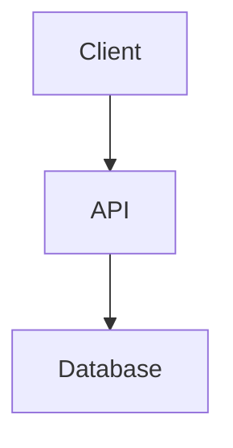

# 🚀 Phase 8 - Advanced IDE Features

**Date**: 2025-12-30
**Status**: 📋 **PLANNING**
**Vision**: Transformer le Workspace en IDE intelligent piloté par agents

---

## 🎯 Objectifs Principaux

### 1. Language Server Protocol (LSP) Integration
Ajouter des capacités IDE professionnelles avec LSP pour Python, JavaScript, TypeScript, etc.

### 2. AI-Powered Code Intelligence
Intégrer nos agents directement dans le workspace pour assistance contextuelle en temps réel.

### 3. Advanced Editor Modes
Créer des modes personnalisés par type de fichier avec outils spécialisés.

---

## 📊 Vision Architecture

```
┌─────────────────────────────────────────────────────────────┐
│                    Workspace IDE                             │
├─────────────────────────────────────────────────────────────┤
│                                                               │
│  ┌──────────────┐  ┌──────────────┐  ┌──────────────┐      │
│  │   Monaco     │  │   LSP        │  │   AI Agent   │      │
│  │   Editor     │←→│   Server     │←→│   Assistant  │      │
│  └──────────────┘  └──────────────┘  └──────────────┘      │
│         ↕                 ↕                   ↕              │
│  ┌──────────────────────────────────────────────────────┐  │
│  │           Workspace Backend API                       │  │
│  │  • File Manager    • Git Manager    • Agent Manager  │  │
│  └──────────────────────────────────────────────────────┘  │
│                                                               │
└─────────────────────────────────────────────────────────────┘
```

---

## 🔧 Phase 8.1 - Python Language Server

### Objectif
Ajouter support LSP complet pour Python avec **Pylance** ou **Pyright**.

### Features

#### 1. **Autocomplétion Intelligente**
```python
# User tape: "import num"
# → Autocomplete suggère:
#   • numpy
#   • numbers
#   • numba

# User tape: "df."
# → Autocomplete montre méthodes pandas DataFrame:
#   • df.head()
#   • df.tail()
#   • df.groupby()
```

**Implémentation**:
```typescript
// Monaco Editor avec LSP
import { MonacoLanguageClient } from 'monaco-languageclient';

const pythonClient = new MonacoLanguageClient({
  name: 'Python Language Server',
  clientOptions: {
    documentSelector: [{ scheme: 'file', language: 'python' }],
    synchronize: {
      fileEvents: workspace.createFileSystemWatcher('**/*.py')
    }
  },
  connectionProvider: {
    get: (encoding) => {
      return Promise.resolve({
        reader: new WebSocketMessageReader(socket),
        writer: new WebSocketMessageWriter(socket)
      });
    }
  }
});
```

#### 2. **Linting en Temps Réel**
- Soulignement erreurs syntaxe (rouge)
- Warnings style (jaune)
- Info suggestions (bleu)

**Backend**:
```python
# gathering/lsp/python_server.py
from pyright import PyrightServer

class PythonLSPServer:
    def __init__(self, workspace_path: str):
        self.server = PyrightServer(workspace_path)

    async def get_diagnostics(self, file_path: str):
        """Return errors, warnings, hints."""
        return await self.server.get_diagnostics(file_path)

    async def get_completions(self, file_path: str, position: dict):
        """Get autocomplete suggestions."""
        return await self.server.get_completions(file_path, position)
```

#### 3. **Go to Definition**
- Ctrl+Click sur fonction → Saute à la définition
- Works across files

#### 4. **Hover Documentation**
- Hover sur fonction → Affiche docstring + signature

```python
def calculate_total(items: list[int]) -> int:
    """
    Calculate total sum of items.

    Args:
        items: List of integers to sum

    Returns:
        Total sum as integer
    """
    return sum(items)

# Hover shows:
# ┌─────────────────────────────────┐
# │ calculate_total(items: list[int]) → int │
# │                                   │
# │ Calculate total sum of items.     │
# │                                   │
# │ Args:                             │
# │   items: List of integers to sum  │
# │ Returns:                          │
# │   Total sum as integer            │
# └─────────────────────────────────┘
```

#### 5. **Refactoring**
- Rename symbol (F2)
- Extract method
- Organize imports

### Backend Endpoints

```python
# gathering/api/routers/lsp.py

@router.post("/workspace/{project_id}/lsp/initialize")
async def initialize_lsp(project_id: int, language: str):
    """Start LSP server for language."""
    server = LSPManager.get_server(project_id, language)
    await server.initialize()
    return {"status": "initialized"}

@router.post("/workspace/{project_id}/lsp/completions")
async def get_completions(
    project_id: int,
    file_path: str,
    line: int,
    character: int
):
    """Get autocomplete suggestions."""
    server = LSPManager.get_server(project_id, "python")
    completions = await server.get_completions(file_path, line, character)
    return completions

@router.post("/workspace/{project_id}/lsp/diagnostics")
async def get_diagnostics(project_id: int, file_path: str):
    """Get errors/warnings for file."""
    server = LSPManager.get_server(project_id, "python")
    diagnostics = await server.get_diagnostics(file_path)
    return diagnostics
```

### Frontend Integration

```typescript
// CodeEditor.tsx enhancement
import * as monaco from 'monaco-editor';

useEffect(() => {
  if (language === 'python') {
    // Register Python completion provider
    monaco.languages.registerCompletionItemProvider('python', {
      async provideCompletionItems(model, position) {
        const response = await api.post('/workspace/1/lsp/completions', {
          file_path: filePath,
          line: position.lineNumber,
          character: position.column
        });

        return {
          suggestions: response.data.map(item => ({
            label: item.label,
            kind: monaco.languages.CompletionItemKind[item.kind],
            insertText: item.insertText,
            documentation: item.documentation
          }))
        };
      }
    });

    // Register diagnostics (linting)
    const updateDiagnostics = async () => {
      const response = await api.post('/workspace/1/lsp/diagnostics', {
        file_path: filePath
      });

      monaco.editor.setModelMarkers(model, 'python', response.data.map(d => ({
        severity: monaco.MarkerSeverity[d.severity],
        startLineNumber: d.range.start.line,
        startColumn: d.range.start.character,
        endLineNumber: d.range.end.line,
        endColumn: d.range.end.character,
        message: d.message
      })));
    };

    updateDiagnostics();
    const interval = setInterval(updateDiagnostics, 2000);
    return () => clearInterval(interval);
  }
}, [language, filePath]);
```

---

## 🤖 Phase 8.2 - AI Agent Integration

### Objectif
Intégrer nos agents IA directement dans l'éditeur pour assistance contextuelle.

### Use Cases

#### 1. **Code Explanation (Agent Explainer)**

**UI**:
```
┌─────────────────────────────────────────────┐
│  CodeEditor.tsx                              │
│                                               │
│  1  def fibonacci(n):                        │
│  2      if n <= 1:                           │
│  3          return n                         │  ← [🤖 Explain]
│  4      return fibonacci(n-1) + fibonacci(n-2)│
│                                               │
└─────────────────────────────────────────────┘

User clicks "Explain" → Agent panel opens:

┌─────────────────────────────────────────────┐
│  🤖 Agent Explainer                          │
├─────────────────────────────────────────────┤
│  This is a recursive Fibonacci function:    │
│                                               │
│  • Base case: n ≤ 1 returns n               │
│  • Recursive case: F(n) = F(n-1) + F(n-2)   │
│  • Time complexity: O(2^n) - exponential    │
│  • Space complexity: O(n) - call stack      │
│                                               │
│  ⚠️ Performance Issue:                       │
│  This implementation is inefficient for      │
│  large n. Consider using memoization or      │
│  dynamic programming.                        │
│                                               │
│  [Show optimized version]                    │
└─────────────────────────────────────────────┘
```

**Implementation**:
```typescript
// AIAgentPanel.tsx
interface AgentPanelProps {
  code: string;
  language: string;
  action: 'explain' | 'optimize' | 'fix' | 'test';
}

export function AIAgentPanel({ code, language, action }: AgentPanelProps) {
  const [response, setResponse] = useState('');
  const [loading, setLoading] = useState(true);

  useEffect(() => {
    const runAgent = async () => {
      const result = await api.post('/agents/run', {
        agent_type: 'code_assistant',
        action: action,
        context: {
          code: code,
          language: language,
          file_path: currentFile
        }
      });

      setResponse(result.data.response);
      setLoading(false);
    };

    runAgent();
  }, [code, action]);

  return (
    <div className="ai-agent-panel">
      {loading ? <Spinner /> : <ReactMarkdown>{response}</ReactMarkdown>}
    </div>
  );
}
```

#### 2. **Quick Fix Suggestions**

**Scenario**: User has error in code

```python
# Error: NameError: name 'pd' is not defined
df = pd.DataFrame({'a': [1, 2, 3]})
     ^^
```

**Agent suggests**:
```
┌─────────────────────────────────────────────┐
│  🔧 Quick Fix                                │
├─────────────────────────────────────────────┤
│  Error: 'pd' is not defined                 │
│                                               │
│  Suggestions:                                │
│  • Add import: import pandas as pd          │
│  • Install pandas: pip install pandas       │
│  • Use built-in dict: {'a': [1, 2, 3]}     │
│                                               │
│  [Apply fix 1] [Apply fix 2] [Ignore]       │
└─────────────────────────────────────────────┘
```

#### 3. **Code Review Agent**

**Trigger**: Right-click → "AI Code Review"

**Agent analyzes**:
- Code quality
- Best practices
- Security issues
- Performance bottlenecks

**Output**:
```markdown
## 🔍 Code Review Results

### ✅ Good Practices
- Clear variable names
- Proper error handling
- Good documentation

### ⚠️ Issues Found

**🔴 Security**: SQL Injection Risk (line 45)
```python
# Bad
query = f"SELECT * FROM users WHERE id = {user_id}"

# Fix
query = "SELECT * FROM users WHERE id = ?"
cursor.execute(query, (user_id,))
```

**🟡 Performance**: Inefficient loop (line 67)
```python
# Bad - O(n²)
for i in range(len(items)):
    for j in range(len(items)):
        ...

# Fix - Use set for O(1) lookup
items_set = set(items)
for item in items:
    if item in items_set:
        ...
```

### 📊 Metrics
- Lines of code: 156
- Complexity: Medium
- Test coverage: 45% (recommend 80%)
```

#### 4. **Chat with Code Context**

**Panel**: Split-screen avec chat agent

```
┌─────────────────┬─────────────────────────┐
│  CodeEditor     │  🤖 AI Assistant        │
│                 │                          │
│  [Python code]  │  You: How do I add      │
│                 │  error handling here?   │
│                 │                          │
│                 │  Agent: I can see your  │
│                 │  code uses requests.    │
│                 │  Add try/except:        │
│                 │                          │
│                 │  ```python              │
│                 │  try:                   │
│                 │    response = requests  │
│                 │      .get(url)          │
│                 │    response.raise_for   │
│                 │      _status()          │
│                 │  except requests.       │
│                 │    RequestException:    │
│                 │    logger.error(...)    │
│                 │  ```                    │
│                 │                          │
│                 │  [Insert code]          │
└─────────────────┴─────────────────────────┘
```

**Backend**:
```python
@router.post("/workspace/{project_id}/agent/chat")
async def chat_with_agent(
    project_id: int,
    message: str,
    context: dict  # Current file, selected code, etc.
):
    """Chat with AI agent with code context."""
    agent = AgentManager.get_agent("code_assistant")

    # Build context
    full_context = {
        "user_message": message,
        "current_file": context.get("file_path"),
        "file_content": context.get("content"),
        "selected_code": context.get("selection"),
        "language": context.get("language"),
        "project_files": await FileManager.list_files(project_id)
    }

    response = await agent.process(full_context)
    return {"response": response}
```

#### 5. **Agent Toolbar in Editor**

**UI Integration**:
```typescript
// Enhanced CodeEditor with Agent toolbar
<div className="editor-container">
  {/* Agent Toolbar */}
  <div className="agent-toolbar glass-card">
    <button onClick={() => runAgent('explain')} title="Explain code">
      <MessageCircle className="w-4 h-4" />
    </button>
    <button onClick={() => runAgent('optimize')} title="Optimize">
      <Zap className="w-4 h-4" />
    </button>
    <button onClick={() => runAgent('test')} title="Generate tests">
      <TestTube className="w-4 h-4" />
    </button>
    <button onClick={() => runAgent('review')} title="Code review">
      <Search className="w-4 h-4" />
    </button>
    <button onClick={() => setShowAgentChat(true)} title="Chat">
      <Bot className="w-4 h-4" />
    </button>
  </div>

  {/* Monaco Editor */}
  <MonacoEditor ... />

  {/* Agent Panel (collapsible) */}
  {showAgentPanel && (
    <ResizablePanel>
      <AIAgentPanel ... />
    </ResizablePanel>
  )}
</div>
```

---

## 🎨 Phase 8.3 - Advanced Editor Modes

### Objectif
Modes personnalisés par type de fichier avec outils spécialisés.

### 1. **Python Development Mode**

**Layout**: 65% Code | 35% Multi-tab panel

**Tabs**:
- **Console** - REPL Python interactif
- **Debugger** - Breakpoints, step through
- **Tests** - Run pytest, voir résultats
- **Profiler** - Performance analysis
- **AI Assistant** - Code help

**Features**:
```python
# In editor:
def slow_function():  # ← [⚡ Profile this]
    ...

# Click → Profiler tab opens avec:
# Function: slow_function
# Time: 2.45s
# Calls: 1,234
# Bottleneck: Line 156 (87% of time)
```

### 2. **Markdown Enhanced Mode**

**Features**:
- Live preview (existing ✓)
- **Mermaid diagrams** rendering
- **LaTeX math** rendering
- **Table editor** GUI
- **Image paste** from clipboard
- **Spell check** + grammar

**Example**:
```markdown
# Architecture



Math: $E = mc^2$

| Feature | Status |
|---------|--------|
| Images  | ✓      |
```

**Renders**:
- Mermaid → SVG diagram
- LaTeX → Formatted math
- Table → Interactive editor

### 3. **JSON/YAML Schema Mode**

**Features**:
- Schema validation
- Autocomplete based on schema
- Tree view + raw view
- Format/minify

**Example**:
```json
{
  "name": "gathering",  ← Autocomplete from schema
  "version": "0.1.2",   ← Validates semver
  "invalid": true       ← ⚠️ Unknown property
}
```

### 4. **SQL Query Mode**

**Features**:
- Syntax highlighting
- Query execution
- Results table
- Explain plan
- Query history

**Layout**:
```
┌─────────────────────┬─────────────────┐
│  SQL Editor         │  Results        │
│                     │                  │
│  SELECT * FROM      │  ┌──────┬─────┐ │
│    users            │  │ id   │name │ │
│  WHERE              │  ├──────┼─────┤ │
│    active = true    │  │ 1    │John │ │
│  LIMIT 100;         │  │ 2    │Jane │ │
│                     │  └──────┴─────┘ │
│  [▶ Run] [Explain]  │  Rows: 2        │
└─────────────────────┴─────────────────┘
```

### 5. **Jupyter Notebook Mode**

**Features**:
- Cell-based editing
- Inline execution
- Rich outputs (plots, tables)
- Kernel management

**Already supported via** `.ipynb` files with `NotebookEdit` tool.

---

## 🔌 Phase 8.4 - Plugin System for Editors

### Objectif
Permettre extensions personnalisées par utilisateur.

### Architecture

```typescript
// Plugin API
interface EditorPlugin {
  name: string;
  version: string;
  supports: string[];  // ['python', 'javascript', ...]

  onActivate(editor: MonacoEditor): void;
  onDeactivate(): void;

  // Hooks
  onFileSave?(content: string): string;
  onKeyPress?(event: KeyboardEvent): void;
  onTextChange?(changes: TextChange[]): void;

  // UI Extensions
  toolbarButtons?: ToolbarButton[];
  contextMenu?: ContextMenuItem[];
  sidebarPanels?: SidebarPanel[];
}
```

### Example Plugin

```typescript
// plugins/CodeFormatterPlugin.ts
export const CodeFormatterPlugin: EditorPlugin = {
  name: 'Code Formatter',
  version: '1.0.0',
  supports: ['python', 'javascript', 'typescript'],

  onActivate(editor) {
    // Register format command
    editor.addAction({
      id: 'format-code',
      label: 'Format Code',
      keybindings: [monaco.KeyMod.CtrlCmd | monaco.KeyCode.KeyF],
      run: async () => {
        const code = editor.getValue();
        const formatted = await api.post('/format', {
          code,
          language: editor.getModel().getLanguageId()
        });
        editor.setValue(formatted.data);
      }
    });
  },

  toolbarButtons: [{
    icon: 'format-align-left',
    tooltip: 'Format Code',
    onClick: () => editor.trigger('', 'format-code', null)
  }]
};
```

---

## 📊 Implementation Roadmap

### Sprint 1: LSP Foundation (2 weeks)
- [ ] LSP protocol implementation
- [ ] Python LSP server integration
- [ ] Basic autocomplete
- [ ] Diagnostics (linting)

### Sprint 2: LSP Advanced (1 week)
- [ ] Go to definition
- [ ] Hover documentation
- [ ] Rename refactoring
- [ ] Organize imports

### Sprint 3: Agent Integration (2 weeks)
- [ ] Agent API endpoints
- [ ] Agent toolbar UI
- [ ] Code explanation agent
- [ ] Quick fix suggestions

### Sprint 4: Advanced Modes (2 weeks)
- [ ] Python dev mode
- [ ] Markdown enhanced mode
- [ ] JSON schema mode
- [ ] SQL query mode

### Sprint 5: Plugin System (1 week)
- [ ] Plugin API design
- [ ] Plugin loader
- [ ] Sample plugins
- [ ] Plugin marketplace UI

---

## 🔧 Technical Stack

### Backend
```python
# New dependencies
pyright>=1.1.0           # Python LSP server
pylsp>=1.0.0             # Alternative LSP
black>=23.0.0            # Code formatter
mypy>=1.0.0              # Type checker
```

### Frontend
```json
{
  "monaco-languageclient": "^7.0.0",
  "vscode-languageserver-protocol": "^3.17.0",
  "vscode-languageserver-types": "^3.17.0",
  "@codemirror/lang-python": "^6.0.0",
  "react-markdown": "^9.0.0",
  "mermaid": "^10.0.0",
  "katex": "^0.16.0"
}
```

### WebSocket for LSP
```python
# gathering/lsp/websocket.py
from fastapi import WebSocket
from pyright import PyrightServer

class LSPWebSocketManager:
    def __init__(self):
        self.connections = {}
        self.servers = {}

    async def connect(self, websocket: WebSocket, project_id: int):
        await websocket.accept()
        self.connections[project_id] = websocket
        self.servers[project_id] = PyrightServer()

    async def handle_message(self, project_id: int, message: dict):
        """Process LSP protocol messages."""
        server = self.servers[project_id]
        response = await server.handle_message(message)
        await self.connections[project_id].send_json(response)
```

---

## 🎯 Success Metrics

### Performance
- Autocomplete latency: < 100ms
- Diagnostics update: < 500ms
- Agent response: < 2s

### UX
- Autocomplete accuracy: > 90%
- Agent helpful rate: > 85%
- User satisfaction: > 4.5/5

### Adoption
- LSP usage: 80% of Python edits
- Agent usage: 50% of sessions
- Plugin installations: 3+ per user

---

## 💡 Future Enhancements

### Phase 9: Collaborative Editing
- Real-time collaboration (like Google Docs)
- Shared cursors
- Comments & annotations
- Code review workflow

### Phase 10: AI Copilot
- Inline code generation
- Multi-line autocomplete
- Refactoring suggestions
- Test generation

### Phase 11: Cloud Development
- Remote containers
- Cloud workspaces
- Serverless functions testing
- CI/CD integration

---

## 🚀 Getting Started

### For Developers

```bash
# Install LSP dependencies
pip install pyright pylsp black mypy

# Start LSP server
python -m gathering.lsp.server --port 8001

# Frontend development
cd dashboard
npm install monaco-languageclient
npm run dev
```

### For Users

```
1. Open Python file in Workspace
2. LSP activates automatically
3. Start typing → Autocomplete appears
4. Click 🤖 button → Agent assistance
5. Right-click → Advanced features menu
```

---

**Status**: 📋 Planning Phase
**Next Step**: Prototype LSP integration
**Target**: Phase 8.1 completion by Q1 2026

🚀 Le Workspace IDE devient un environnement de développement intelligent de niveau professionnel !
