# Dashboard Guide

The GatheRing Dashboard is a modern React-based web interface for managing AI agents, circles, conversations, and more.

```{tip}
**Click on any image** to enlarge it and see details clearly.
```

## Quick Start Workflow

The typical workflow to get started with GatheRing:

1. **Import a Project** → Define the workspace your agents will work on
2. **Configure Agents** → Set up your AI agents with appropriate skills
3. **Create Circles** → Group agents into collaborative teams
4. **Launch! 🚀** → Assign tasks, start conversations, and let agents collaborate

## Overview

The dashboard provides a visual interface to:

- **Manage Projects**: Import and configure project workspaces
- **Manage Agents**: Create, configure, and chat with AI agents
- **Configure Skills**: Enable/disable agent capabilities per agent
- **Monitor Circles**: View team collaboration and task routing
- **Track Tasks**: Kanban-style task management
- **View Conversations**: Inter-agent collaboration history
- **Manage Goals**: Hierarchical goal tracking
- **Schedule Actions**: Automated agent tasks with crash recovery
- **Browse Knowledge**: Search the semantic knowledge base
- **Configure Settings**: API keys and system parameters

## Getting Started

### Starting the Dashboard

```bash
# From the project root
cd dashboard
npm install
npm run dev
```

The dashboard runs on `http://localhost:3000` by default and connects to the API at `http://localhost:8000`.

### Navigation

The sidebar provides access to all main sections:

| Icon | Section | Description |
|------|---------|-------------|
| Home | Dashboard | Overview with system metrics |
| FolderGit | Projects | Project management |
| Bot | Agents | Agent management and chat |
| Users | Circles | Team orchestration |
| Layout | Board | Task kanban board |
| MessageSquare | Conversations | Inter-agent discussions |
| Target | Goals | Agent objectives |
| Clock | Schedules | Automated actions |
| Brain | Knowledge | Semantic search |
| FolderOpen | Workspace | File browser |
| GitBranch | Git | Version control |
| Settings | Settings | Configuration |

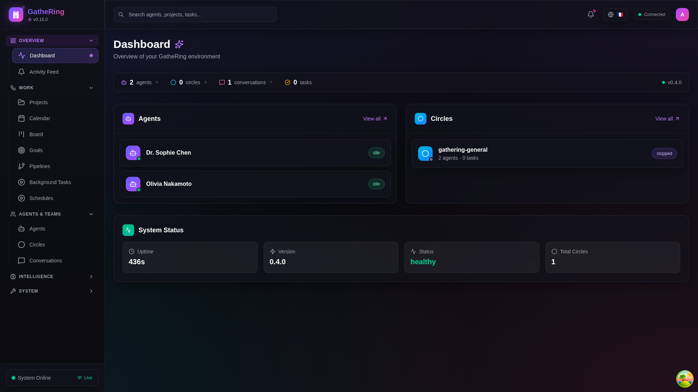

*Dashboard overview showing system metrics and quick actions*

## Projects

Projects define the workspace context for your agents. Before agents can work on code, you need to import a project.

### Project List

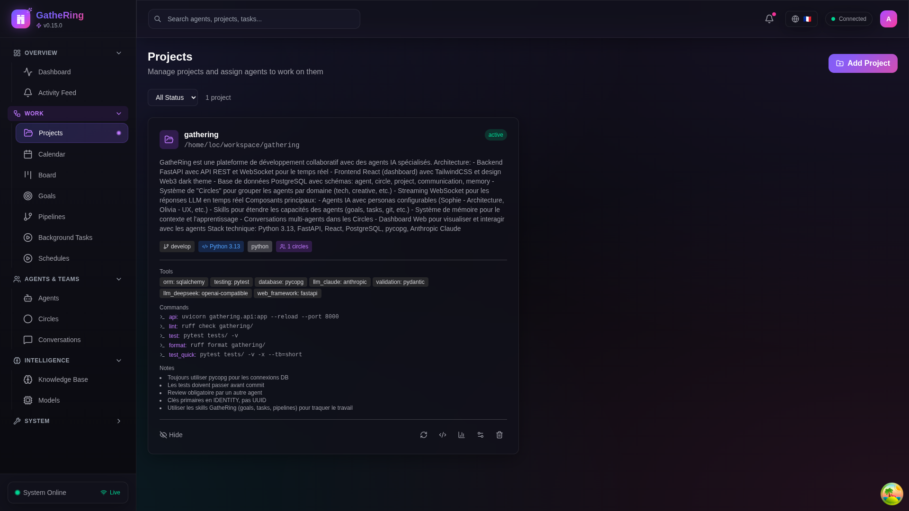

*Projects page showing imported projects with their status and actions*

### Importing a Project

1. Click **+ New Project** button
2. Enter the project name and path
3. Select the primary language/framework
4. Configure optional settings (Git integration, auto-indexing)
5. Click **Import**

### Project Features

- **File indexing**: Automatic code analysis for context
- **Git integration**: Track changes and branches
- **Agent assignment**: Link agents to specific projects
- **Workspace sync**: Keep agents updated with latest changes

## Agent Management

### Agent List

The Agents page displays all configured agents with their status, model, and quick actions.

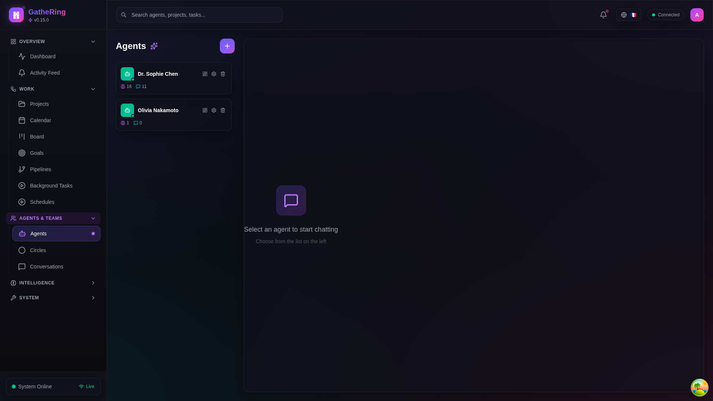

*Screenshot: Agent list showing Sophie and Olivia with their status indicators*

### Agent Chat

Click on an agent to open the streaming chat interface. Messages are delivered in real-time via WebSocket.

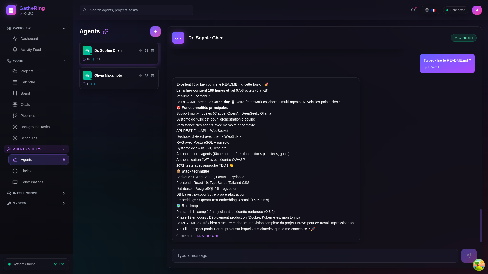

*Screenshot: Chat interface with streaming responses*

### Agent Dashboard

Click the dashboard icon on an agent card to access their personal dashboard with:

- Activity statistics
- Configured skills
- Current tasks
- Active goals
- Recent conversations
- Memory entries

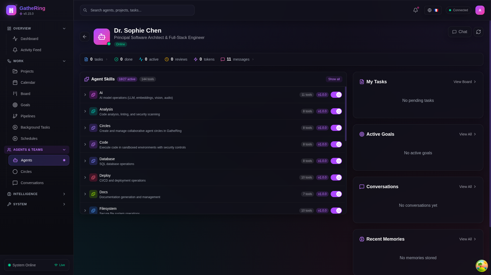

*Screenshot: Agent dashboard showing skills panel and statistics*

## Skills Configuration

### Skills Panel

Each agent can be configured with different skills (capabilities). The Skills panel shows:

- **Active skills**: Currently enabled for the agent
- **Available skills**: Can be enabled via toggle
- **Tools count**: Number of tools provided by active skills

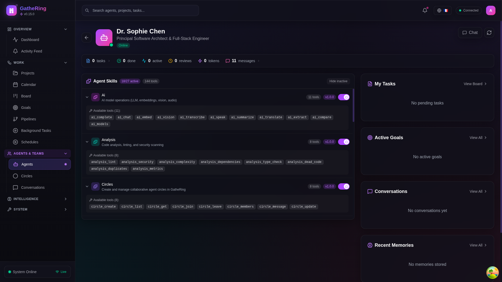

*Screenshot: Skills panel with toggles for enabling/disabling capabilities*

### Available Skills

| Skill | Description | Tools |
|-------|-------------|-------|
| `filesystem` | Read/write files, list directories | 10 |
| `git` | Version control operations | 13 |
| `code` | Code execution and analysis | 8 |
| `shell` | Shell command execution | 6 |
| `database` | Database queries and management | 7 |
| `http` | HTTP requests and API calls | 5 |
| `goals` | Goal management | 6 |
| `tasks` | Task management | 8 |
| `pipelines` | Pipeline execution | 5 |
| `schedules` | Scheduled actions | 6 |
| `circles` | Circle management | 4 |
| `ai` | AI/ML operations | 5 |
| `analysis` | Data analysis | 6 |
| `docs` | Documentation generation | 4 |
| `deploy` | Deployment operations | 5 |
| `test` | Testing operations | 6 |
| `web` | Web scraping and browsing | 4 |
| `projects` | Project management | 5 |

### Enabling Skills

1. Navigate to the Agent Dashboard
2. In the Skills panel, click "Show all" to see inactive skills
3. Toggle the switch to enable/disable a skill
4. Changes are saved immediately to the database

### Viewing Skill Tools

Click on an active skill to expand it and see all available tools:


*Screenshot: Expanded skill showing available tools*

## Circles (Team Orchestration)

Circles are collaborative teams of agents working together on tasks.

### Circle Overview


*Screenshot: Circles page showing team members and status*

### Circle Features

- **Task routing**: Automatically assign tasks to best-suited agents
- **Code reviews**: Agents review each other's work
- **Conflict detection**: Identify overlapping file edits
- **Real-time updates**: WebSocket notifications for changes

## Task Board

The Kanban-style task board provides visual task management.

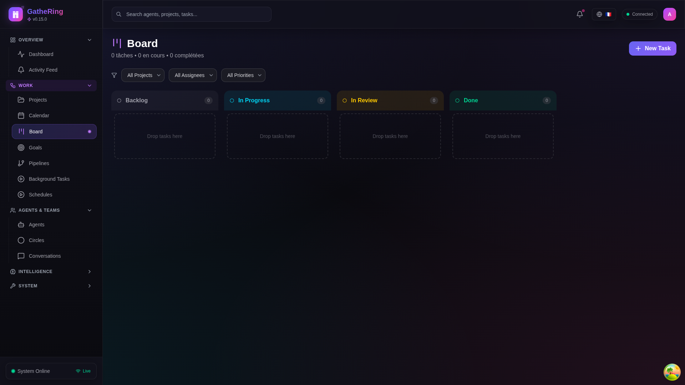

*Screenshot: Task board with columns for different statuses*

### Task Statuses

- **Backlog**: Tasks waiting to be started
- **In Progress**: Currently being worked on
- **Review**: Awaiting peer review
- **Done**: Completed tasks

## Conversations

View and manage inter-agent conversations.

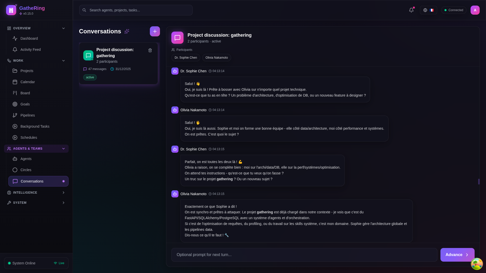

*Screenshot: Conversation list and detail view*

### Conversation Features

- Turn-based or free-form discussion modes
- Message history with timestamps
- Agent participation tracking

## Goals

Hierarchical goal management with progress tracking.

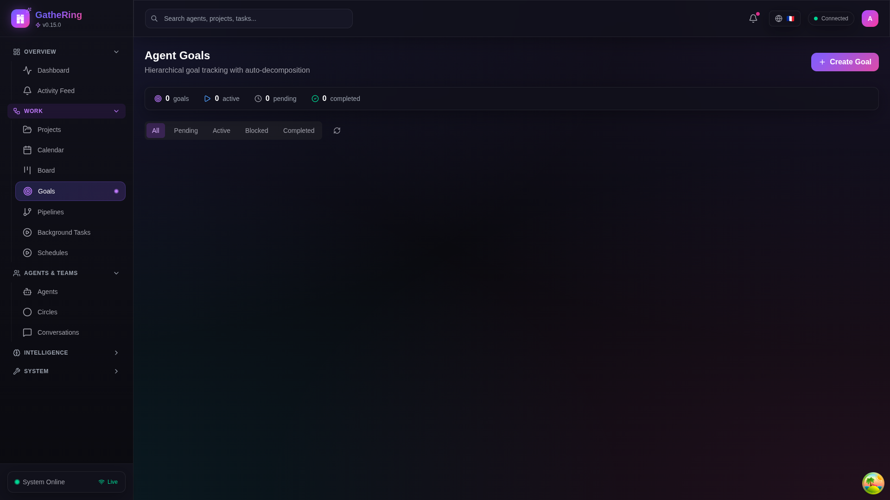

*Screenshot: Goals page with progress indicators*

### Goal Structure

- **Main goals**: High-level objectives
- **Subgoals**: Breakdown into actionable items
- **Progress**: Automatic calculation from subgoals

## Knowledge Base

Semantic search across documentation and learned information.

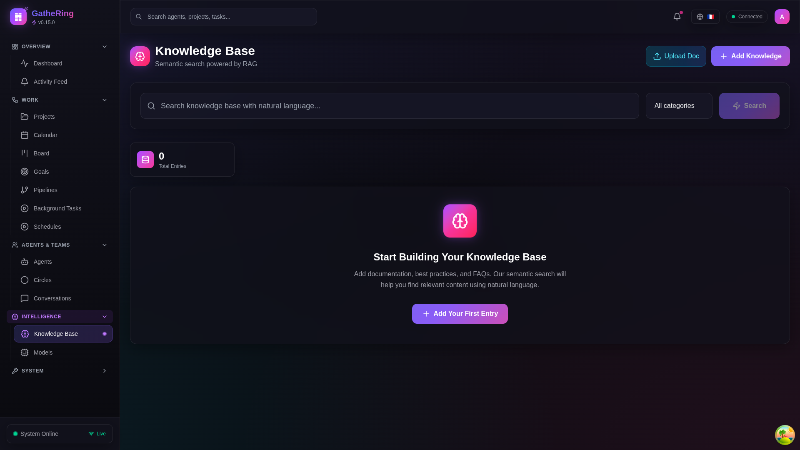

*Screenshot: Knowledge base with search and results*

### Features

- Vector similarity search
- Category filtering
- Source tracking

## Workspace

Integrated file browser and code viewer.

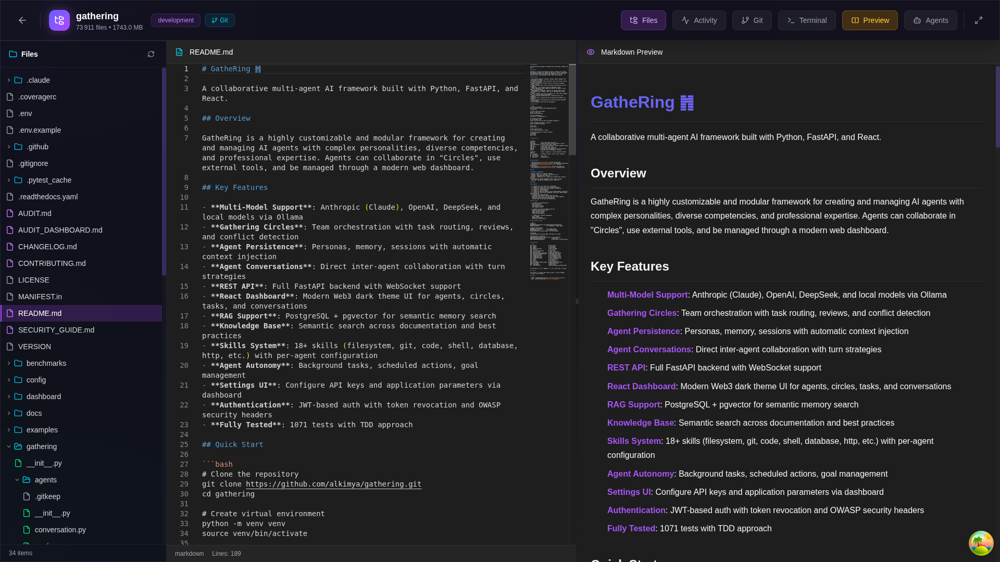

*Screenshot: File browser with code preview*

### Supported Features

- File tree navigation
- Syntax-highlighted code viewer
- Image preview
- PDF viewer
- Terminal integration

## Git Integration

Visual git operations and history.

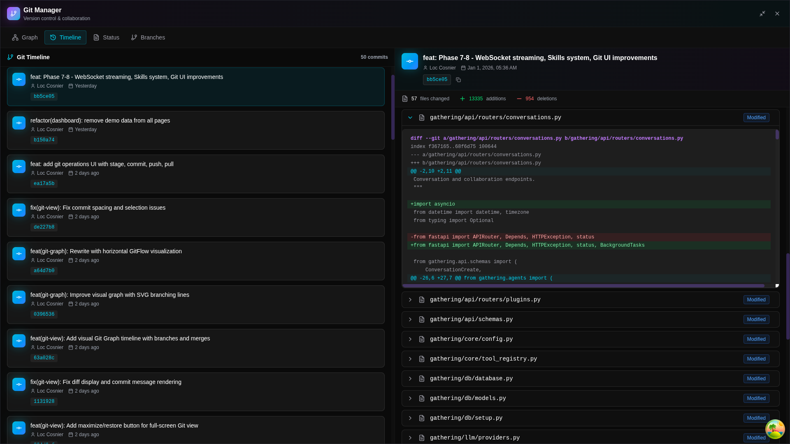

*Screenshot: Git view with commit history and staging*

### Features

- Commit history graph
- File staging
- Diff viewer
- Branch management

## Settings

Configure API keys and system parameters.

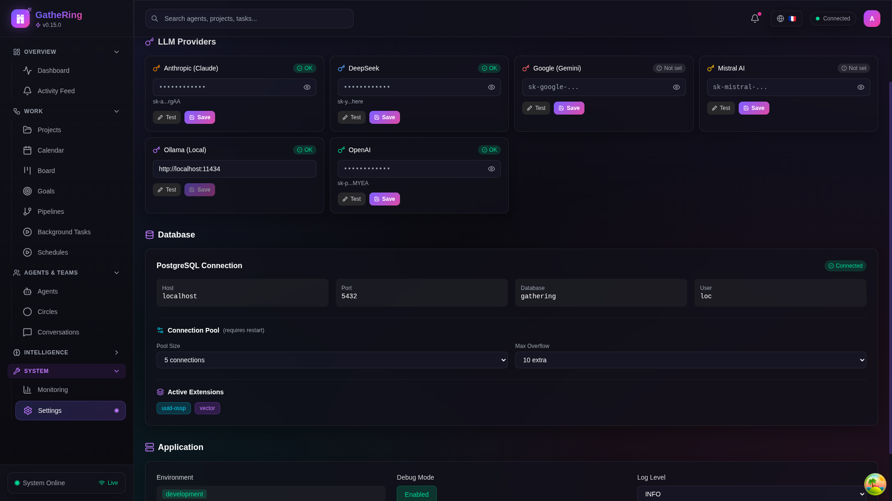

*Screenshot: Settings page with provider configuration*

### Configurable Settings

- **Providers**: API keys for Anthropic, OpenAI, DeepSeek, etc.
- **Application**: Default model, temperature, max tokens
- **Database**: Connection parameters

## Keyboard Shortcuts

| Shortcut | Action |
|----------|--------|
| `Ctrl+K` | Quick search |
| `Escape` | Close modal |
| `Enter` | Send message (in chat) |
| `Shift+Enter` | New line (in chat) |

## Troubleshooting

### Dashboard won't connect to API

1. Ensure the API is running: `uvicorn gathering.api:app --reload`
2. Check the proxy config in `vite.config.ts`
3. Verify CORS settings if running on different ports

### WebSocket disconnects

1. Check browser console for errors
2. Verify the API WebSocket endpoint is accessible
3. Try refreshing the page

### Skills not loading

1. Ensure the agent exists in the database
2. Check API logs for skill loading errors
3. Verify skill registry is properly configured

## Development

### Building for Production

```bash
cd dashboard
npm run build
```

The build output is in `dashboard/dist/`.

### Running Tests

```bash
npm run test
npm run test:coverage
```

### Code Style

The dashboard uses:

- TypeScript for type safety
- Tailwind CSS for styling
- React Query for data fetching
- Lucide React for icons
